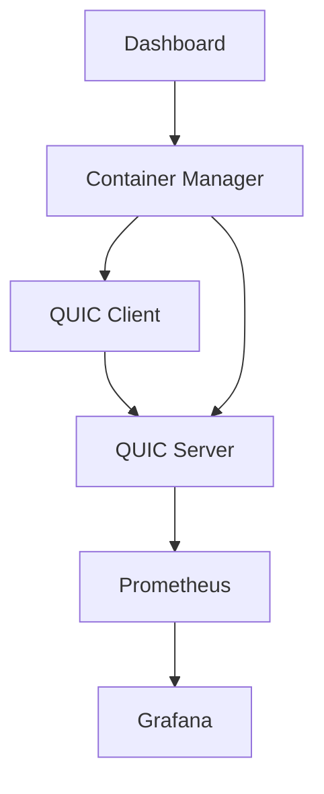
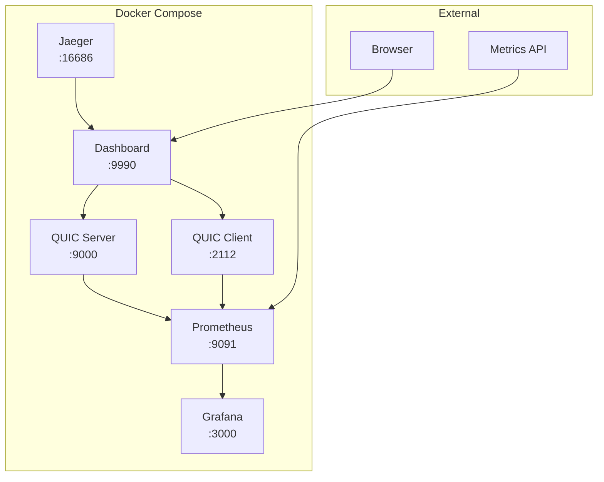

# CloudBridge Research

<div align="center">


## QUIC Test

Professional QUIC protocol testing platform for network engineers, researchers, and educators.

[](https://github.com/cloudbridge-research/quic-test/actions)
[](https://goreportcard.com/report/github.com/cloudbridge-research/quic-test)
[](LICENSE)
[](https://hub.docker.com/r/cloudbridge/quic-test)
[](go.mod)

[](prometheus/)
[](grafana/)
[](docker-compose.yml)
[](https://datatracker.ietf.org/doc/html/rfc9000)

</div>

[English](readme_en.md) | **Русский**

## Что это?

<table>
<tr>
<td width="60%">

`quic-test` — это профессиональная платформа для тестирования и анализа производительности протокола QUIC. Разработана для образовательных и исследовательских целей, с акцентом на воспроизводимость результатов и детальную аналитику.

</td>
<td width="40%">



</td>
</tr>
</table>

**Основные возможности:**

<div align="center">

| Компонент | Описание | Статус |
|-----------|----------|--------|
| Web Dashboard | Web GUI интерфейс для менее технических пользователей | Готово |
| Metrics | Измерение latency, jitter, throughput для QUIC и TCP | Готово |
| Network Emulation | Эмуляция различных сетевых условий (потери, задержки, bandwidth) | Готово |
| TUI Visualization | Real-time TUI визуализация | Готово |
| Prometheus Export | Экспорт метрик в Prometheus | Готово |
| WebTransport Testing | WebTransport и HTTP/3 load testing | Готово |
| FEC SIMD | Forward Error Correction с SIMD оптимизацией | Экспериментально |
| PQC Simulation | Post-Quantum Cryptography симуляция | Экспериментально |
| BBRv3 | BBRv3 congestion control с dual-scale bandwidth estimation | Экспериментально |

</div>

## Quick Start

### Docker Compose (рекомендуется)

<div align="center">


</div>

Самый простой способ запустить полную платформу:

```bash
# Клонирование репозитория
git clone https://github.com/cloudbridge-research/quic-test
cd quic-test

# Запуск всех сервисов
docker-compose up -d

# Открыть веб-дашборд
open http://localhost:9990
```

**Доступные сервисы:**

<table>
<tr>
<th>Сервис</th>
<th>URL</th>
<th>Описание</th>
</tr>
<tr>
<td>Dashboard</td>
<td><a href="http://localhost:9990">localhost:9990</a></td>
<td>Веб-интерфейс управления тестами</td>
</tr>
<tr>
<td>Prometheus</td>
<td><a href="http://localhost:9091">localhost:9091</a></td>
<td>Сбор и хранение метрик</td>
</tr>
<tr>
<td>Grafana</td>
<td><a href="http://localhost:3000">localhost:3000</a></td>
<td>Визуализация метрик (admin/admin)</td>
</tr>
<tr>
<td>Jaeger</td>
<td><a href="http://localhost:16686">localhost:16686</a></td>
<td>Трейсинг и мониторинг</td>
</tr>
<tr>
<td>QUIC Server</td>
<td>localhost:9000</td>
<td>QUIC сервер для тестирования</td>
</tr>
</table>

### GUI Interface (для начинающих)

```bash
# Сборка GUI
make build

# Запуск GUI сервера
make gui
# или
./quic-gui --addr=:8080 --api-addr=:8081

# Открыть браузер
open http://localhost:8080
```

**GUI возможности:**
- Создание тестов через веб-форму
- Real-time мониторинг активных тестов
- История тестов с детальными метриками
- Остановка тестов одним кликом
- Готовые пресеты для различных сценариев

### Отдельные Docker контейнеры

```bash
# Запуск QUIC сервера
docker-compose up -d quic-server

# Запуск клиентского теста
docker-compose up quic-client

# Запуск только дашборда
docker-compose up -d dashboard

# Просмотр логов
docker-compose logs -f quic-server
```

### Command Line Interface

```bash
# Сборка из исходников
git clone https://github.com/cloudbridge-research/quic-test
cd quic-test

# Сборка FEC библиотеки (опционально, для лучшей производительности)
cd internal/fec && make && cd ../..

# Сборка всех компонентов
make build

# Базовый тест
./quic-test --mode=client --server=demo.quic.tech:4433
```

## Основные режимы

```bash
# Простой тест latency/throughput
./quic-test --mode=client --server=localhost:4433 --duration=30s

# Сравнение QUIC vs TCP
./quic-test --mode=client --compare-tcp --duration=60s

# Эмуляция мобильной сети
./quic-test --profile=mobile --duration=30s

# TUI мониторинг
./cmd/tui/tui --server=localhost:4433

# WebTransport тестирование
make test-webtransport

# HTTP/3 load testing
make test-http3
```

## Архитектура

<div align="center">


</div>

### Контейнерная архитектура



### Структура проекта

```
quic-test/
├── Docker Infrastructure
│   ├── docker-compose.yml         # Оркестрация сервисов
│   ├── Dockerfile.server          # QUIC сервер контейнер
│   ├── Dockerfile.client          # QUIC клиент контейнер
│   └── Dockerfile.dashboard       # Веб-дашборд контейнер
├── Core Applications
│   ├── cmd/
│   │   ├── gui/                   # Web GUI интерфейс
│   │   ├── tui/                   # Terminal UI мониторинг
│   │   ├── dashboard/             # Веб-дашборд
│   │   ├── quic-client/           # Standalone QUIC клиент
│   │   ├── quic-server/           # Standalone QUIC сервер
│   │   └── experimental/          # Экспериментальные функции
├── Internal Libraries
│   ├── internal/
│   │   ├── dashboard/             # Dashboard API и управление
│   │   ├── container/             # Docker контейнер менеджер
│   │   ├── quic/                  # QUIC логика
│   │   ├── fec/                   # Forward Error Correction (C++/AVX2)
│   │   ├── congestion/            # BBRv2/BBRv3 алгоритмы
│   │   ├── webtransport/          # WebTransport поддержка
│   │   ├── http3/                 # HTTP/3 load testing
│   │   ├── pqc/                   # Post-Quantum Crypto симуляция
│   │   ├── metrics/               # Prometheus метрики
│   │   └── ca/                    # Certificate Authority
├── Web Interface
│   ├── web/
│   │   ├── templates/             # HTML шаблоны
│   │   └── static/                # CSS/JS ресурсы
├── Monitoring
│   ├── prometheus/                # Prometheus конфигурация
│   ├── grafana/                   # Grafana дашборды
│   └── certs/                     # TLS сертификаты (CA)
└── Documentation
    └── docs/                      # Документация проекта
```

### Компоненты системы

<table>
<tr>
<th>Компонент</th>
<th>Технология</th>
<th>Назначение</th>
<th>Порт</th>
</tr>
<tr>
<td>Dashboard</td>
<td>Go + HTML/JS</td>
<td>Веб-интерфейс управления</td>
<td>9990</td>
</tr>
<tr>
<td>QUIC Server</td>
<td>quic-go</td>
<td>QUIC протокол сервер</td>
<td>9000</td>
</tr>
<tr>
<td>QUIC Client</td>
<td>quic-go</td>
<td>QUIC протокол клиент</td>
<td>2112</td>
</tr>
<tr>
<td>Prometheus</td>
<td>Prometheus</td>
<td>Сбор метрик</td>
<td>9091</td>
</tr>
<tr>
<td>Grafana</td>
<td>Grafana</td>
<td>Визуализация данных</td>
<td>3000</td>
</tr>
<tr>
<td>Jaeger</td>
<td>Jaeger</td>
<td>Распределенный трейсинг</td>
<td>16686</td>
</tr>
</table>

## Возможности

### Стабильные функции

<div align="center">

| Функция | Статус | Описание |
|---------|--------|----------|
| Web GUI | Готово | Удобный веб-интерфейс для создания и мониторинга тестов |
| QUIC Protocol | Готово | QUIC client/server на базе quic-go с расширениями |
| Metrics | Готово | Измерение RTT, jitter, throughput — детальная аналитика производительности |
| Network Profiles | Готово | Эмуляция сетевых профилей — mobile, satellite, fiber, WiFi |
| TUI | Готово | TUI визуализация — real-time мониторинг в терминале |
| Prometheus | Готово | Prometheus экспорт — интеграция с системами мониторинга |
| BBRv2 | Готово | BBRv2 congestion control — современный алгоритм управления перегрузкой |
| Docker | Готово | Контейнерная архитектура с docker-compose |
| Certificate Authority | Готово | Встроенный CA для автоматической генерации TLS сертификатов |

</div>

### Экспериментальные функции

<div align="center">

| Функция | Статус | Описание |
|---------|--------|----------|
| BBRv3 | Экспериментально | BBRv3 congestion control с dual-scale bandwidth estimation и 2% loss threshold |
| FEC | Экспериментально | Forward Error Correction с AVX2/SIMD оптимизацией |
| WebTransport | Экспериментально | WebTransport support — тестирование WebTransport соединений |
| HTTP/3 | Экспериментально | HTTP/3 load testing — нагрузочное тестирование HTTP/3 |
| PQC | Экспериментально | Post-Quantum Cryptography — симуляция PQC алгоритмов (ML-KEM, Dilithium) |
| MASQUE | Экспериментально | MASQUE VPN тестирование — тесты VPN через QUIC |
| ICE/STUN/TURN | Экспериментально | ICE/STUN/TURN тесты — тестирование NAT traversal |

</div>

### В планах (Roadmap)

<div align="center">

| Функция | Статус | Приоритет |
|---------|--------|-----------|
| AI Anomaly Detection | Планируется | Высокий |
| Multi-Cloud Deployment | Планируется | Средний |
| Extended AI Integration | Планируется | Средний |
| QUIC v2 Support | Планируется | Низкий |

</div>

**Полный roadmap:** [docs/roadmap.md](docs/roadmap.md)

## Документация

<div align="center">


</div>

<table>
<tr>
<th>Категория</th>
<th>Документ</th>
<th>Описание</th>
</tr>
<tr>
<td rowspan="3">Education</td>
<td><a href="docs/MEI_COLLABORATION_REPORT.md">Отчет о сотрудничестве с МЭИ</a></td>
<td>Показатели проекта и программа стажировок</td>
</tr>
<tr>
<td><a href="docs/STUDENT_GUIDE.md">Путеводитель для студентов</a></td>
<td>Терминология, TCP vs QUIC, RFC документы</td>
</tr>
<tr>
<td><a href="docs/education.md">Лабораторные работы</a></td>
<td>Готовые лабораторные работы для университетов</td>
</tr>
<tr>
<td rowspan="3">Technical</td>
<td><a href="docs/API_REFERENCE.md">API Reference</a></td>
<td>Полная справка по REST API</td>
</tr>
<tr>
<td><a href="docs/cli.md">CLI Reference</a></td>
<td>Справка по командам командной строки</td>
</tr>
<tr>
<td><a href="docs/architecture.md">Architecture</a></td>
<td>Детальная архитектура системы</td>
</tr>
<tr>
<td rowspan="3">Integration</td>
<td><a href="docs/ai-routing-integration.md">AI Integration</a></td>
<td>Интеграция с AI Routing Lab</td>
</tr>
<tr>
<td><a href="docs/case-studies.md">Case Studies</a></td>
<td>Результаты тестов с методикой</td>
</tr>
<tr>
<td><a href="docs/TUI_USER_GUIDE.md">TUI User Guide</a></td>
<td>Руководство по TUI интерфейсу</td>
</tr>
<tr>
<td rowspan="2">Security</td>
<td><a href="docs/CA_SETUP.md">Certificate Authority Setup</a></td>
<td>Настройка встроенного CA и TLS сертификатов</td>
</tr>
<tr>
<td><a href="docs/roadmap.md">Roadmap</a></td>
<td>Планы развития проекта</td>
</tr>
</table>

## GUI Интерфейс

Web GUI предоставляет удобный интерфейс для пользователей без глубоких технических знаний:

### Основные возможности GUI:
- **Dashboard** — обзор активных тестов и системного статуса
- **New Test** — создание тестов через веб-форму с валидацией
- **Test History** — просмотр всех выполненных тестов
- **Test Details** — детальный просмотр метрик и логов теста
- **Real-time Updates** — автоматическое обновление статуса тестов

### API Endpoints:
- `POST /api/tests` — создание нового теста
- `GET /api/tests` — получение списка тестов
- `GET /api/tests/{id}` — получение деталей теста
- `DELETE /api/tests/{id}` — остановка теста
- `GET /api/metrics/current` — текущие агрегированные метрики
- `GET /api/metrics/prometheus` — метрики в формате Prometheus

**Подробнее:** [docs/API_REFERENCE.md](docs/API_REFERENCE.md)

## Для университетов

Проект разработан с акцентом на образование и подготовку кадров. Включает готовые лабораторные работы, образовательные материалы и программу стажировок.

### Образовательные ресурсы:
- **[Путеводитель для студентов](docs/STUDENT_GUIDE.md)** — терминология, сравнение TCP vs QUIC, RFC документы
- **Практические лабораторные работы** с пошаговыми инструкциями
- **Готовые сценарии тестирования** для различных сетевых условий

### Лабораторные работы:
- **ЛР #1:** Основы QUIC — handshake, 0-RTT, миграция соединений
- **ЛР #2:** Congestion Control — сравнение BBRv2 vs BBRv3
- **ЛР #3:** Производительность — QUIC vs TCP в различных условиях
- **ЛР #4:** Forward Error Correction — влияние FEC на производительность
- **ЛР #5:** Post-Quantum Cryptography — тестирование PQC алгоритмов

### Программа стажировок CloudBridge Research

**Подробнее:** [docs/education.md](docs/education.md) | [Отчет о сотрудничестве](docs/MEI_COLLABORATION_REPORT.md)

## Интеграция с AI Routing Lab

`quic-test` экспортирует метрики в Prometheus, которые используются в [AI Routing Lab](https://github.com/cloudbridge-research/ai-routing-lab) для обучения моделей предсказания оптимальных маршрутов.

**Пример:**
```bash
# Запуск с Prometheus экспортом
./quic-test --mode=server --prometheus-port=9090

# AI Routing Lab собирает метрики
curl http://localhost:9090/metrics
```

**Подробнее:** [docs/ai-routing-integration.md](docs/ai-routing-integration.md)

## Разработка

<div align="center">


</div>

### Быстрый старт для разработчиков

```bash
# Клонирование и сборка
git clone https://github.com/cloudbridge-research/quic-test
cd quic-test
make build

# Запуск тестов
make test

# Полный набор тестов
make all

# Smoke test
make smoke
```

### Docker разработка

```bash
# Сборка Docker образов
docker-compose build

# Запуск в режиме разработки
docker-compose up -d

# Просмотр логов
docker-compose logs -f

# Остановка всех сервисов
docker-compose down
```

### Доступные Make команды

<table>
<tr>
<th>Команда</th>
<th>Описание</th>
<th>Время выполнения</th>
</tr>
<tr>
<td><code>make build</code></td>
<td>Сборка всех бинарных файлов</td>
<td>~2 мин</td>
</tr>
<tr>
<td><code>make gui</code></td>
<td>Запуск GUI сервера</td>
<td>Мгновенно</td>
</tr>
<tr>
<td><code>make test</code></td>
<td>Базовые функциональные тесты</td>
<td>~30 сек</td>
</tr>
<tr>
<td><code>make bench-rtt</code></td>
<td>Бенчмарки RTT</td>
<td>~5 мин</td>
</tr>
<tr>
<td><code>make bench-loss</code></td>
<td>Бенчмарки потерь пакетов</td>
<td>~10 мин</td>
</tr>
<tr>
<td><code>make soak-2h</code></td>
<td>2-часовой стресс-тест</td>
<td>2 часа</td>
</tr>
<tr>
<td><code>make regression</code></td>
<td>Полный набор регрессионных тестов</td>
<td>~30 мин</td>
</tr>
<tr>
<td><code>make performance</code></td>
<td>Тесты производительности</td>
<td>~20 мин</td>
</tr>
</table>

### Качество кода

```bash
# Линтинг
golangci-lint run

# Статус сборки
make status

# Проверка зависимостей
go mod verify

# Обновление зависимостей
go mod tidy
```

## Лицензия

<div align="center">

[](https://opensource.org/licenses/MIT)

</div>

MIT License. См. [LICENSE](LICENSE).

## Контакты

<div align="center">

<table>
<tr>
<td align="center">
<br>
<a href="https://github.com/cloudbridge-research/quic-test">cloudbridge-research/quic-test</a>
</td>
<td align="center">
<br>
<a href="https://cloudbridge-research.ru">cloudbridge-research.ru</a>
</td>
<td align="center">
<br>
<a href="mailto:info@cloudbridge-research.ru">info@cloudbridge-research.ru</a>
</td>
</tr>
</table>

---

<p>


</p>

</div>