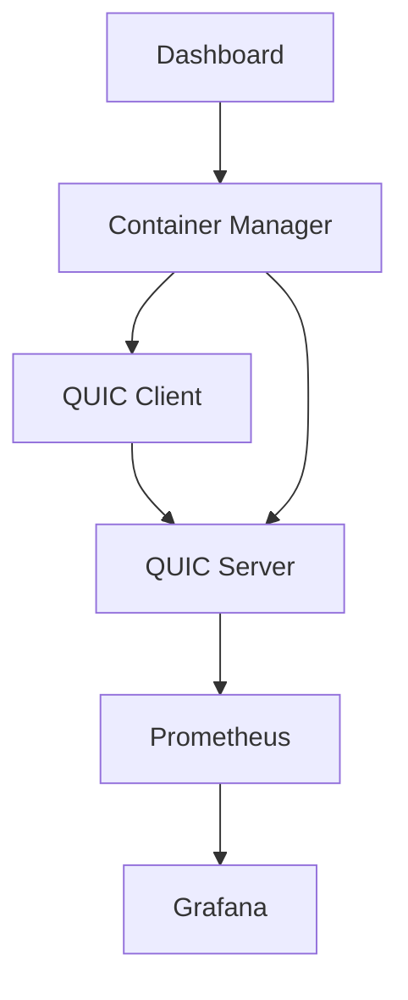
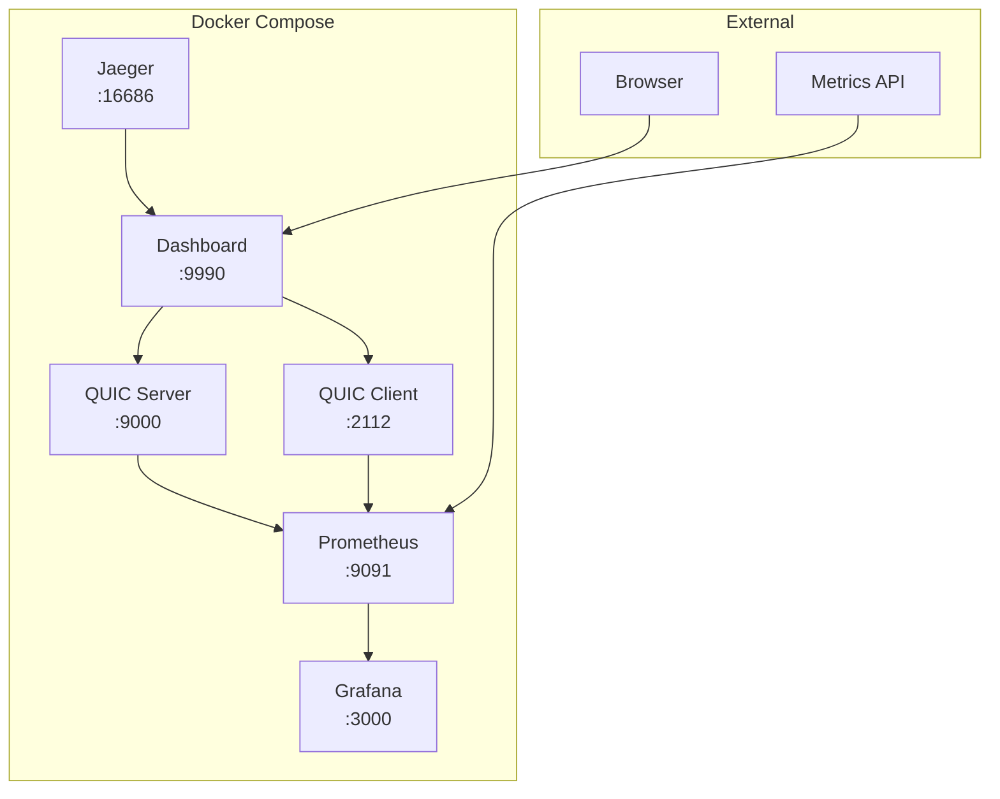

# CloudBridge Research

<div align="center">


## QUIC Test

Professional QUIC protocol testing platform for network engineers, researchers, and educators.

[](https://github.com/cloudbridge-research/quic-test/actions)
[](https://goreportcard.com/report/github.com/cloudbridge-research/quic-test)
[](LICENSE)
[](https://hub.docker.com/r/cloudbridge/quic-test)
[](go.mod)

[](prometheus/)
[](grafana/)
[](docker-compose.yml)
[](https://datatracker.ietf.org/doc/html/rfc9000)

</div>

**English** | [Русский](readme.md)

## What is this?

<table>
<tr>
<td width="60%">

`quic-test` is a professional platform for testing and analyzing QUIC protocol performance. Designed for educational and research purposes, with focus on reproducibility and detailed analytics.

</td>
<td width="40%">



</td>
</tr>
</table>

**Key Features:**

<div align="center">

| Component | Description | Status |
|-----------|-------------|--------|
| Web Dashboard | Web GUI interface for less technical users | Ready |
| Metrics | Measure latency, jitter, throughput for QUIC and TCP | Ready |
| Network Emulation | Emulate various network conditions (loss, delay, bandwidth) | Ready |
| TUI Visualization | Real-time TUI visualization | Ready |
| Prometheus Export | Export metrics to Prometheus | Ready |
| WebTransport Testing | WebTransport and HTTP/3 load testing | Ready |
| FEC SIMD | Forward Error Correction with SIMD optimization | Experimental |
| PQC Simulation | Post-Quantum Cryptography simulation | Experimental |
| BBRv3 | BBRv3 congestion control with dual-scale bandwidth estimation | Experimental |

</div>

## Quick Start

### Docker Compose (recommended)

<div align="center">


</div>

The easiest way to run the complete platform:

```bash
# Clone repository
git clone https://github.com/cloudbridge-research/quic-test
cd quic-test

# Start all services
docker-compose up -d

# Open web dashboard
open http://localhost:9990
```

**Available services:**

<table>
<tr>
<th>Service</th>
<th>URL</th>
<th>Description</th>
</tr>
<tr>
<td>Dashboard</td>
<td><a href="http://localhost:9990">localhost:9990</a></td>
<td>Web interface for test management</td>
</tr>
<tr>
<td>Prometheus</td>
<td><a href="http://localhost:9091">localhost:9091</a></td>
<td>Metrics collection and storage</td>
</tr>
<tr>
<td>Grafana</td>
<td><a href="http://localhost:3000">localhost:3000</a></td>
<td>Metrics visualization (admin/admin)</td>
</tr>
<tr>
<td>Jaeger</td>
<td><a href="http://localhost:16686">localhost:16686</a></td>
<td>Tracing and monitoring</td>
</tr>
<tr>
<td>QUIC Server</td>
<td>localhost:9000</td>
<td>QUIC server for testing</td>
</tr>
</table>

### GUI Interface (for beginners)

```bash
# Build GUI
make build

# Start GUI server
make gui
# or
./quic-gui --addr=:8080 --api-addr=:8081

# Open browser
open http://localhost:8080
```

**GUI Features:**
- Create tests through web forms
- Real-time monitoring of active tests
- Test history with detailed metrics
- Stop tests with one click
- Ready-made presets for various scenarios

### Individual Docker containers

```bash
# Start QUIC server
docker-compose up -d quic-server

# Start client test
docker-compose up quic-client

# Start dashboard only
docker-compose up -d dashboard

# View logs
docker-compose logs -f quic-server
```

### Command Line Interface

```bash
# Build from source
git clone https://github.com/cloudbridge-research/quic-test
cd quic-test

# Build FEC library (optional, for better performance)
cd internal/fec && make && cd ../..

# Build all components
make build

# Run basic test
./quic-test --mode=client --server=demo.quic.tech:4433
```

## Basic Usage

```bash
# Simple latency/throughput test
./quic-test --mode=client --server=localhost:4433 --duration=30s

# Compare QUIC vs TCP
./quic-test --mode=client --compare-tcp --duration=60s

# Emulate mobile network
./quic-test --profile=mobile --duration=30s

# TUI monitoring
./cmd/tui/tui --server=localhost:4433

# WebTransport testing
make test-webtransport

# HTTP/3 load testing
make test-http3
```

## Architecture

<div align="center">


</div>

### Container architecture



### Project structure

```
quic-test/
├── Docker Infrastructure
│   ├── docker-compose.yml         # Service orchestration
│   ├── Dockerfile.server          # QUIC server container
│   ├── Dockerfile.client          # QUIC client container
│   └── Dockerfile.dashboard       # Web dashboard container
├── Core Applications
│   ├── cmd/
│   │   ├── gui/                   # Web GUI interface
│   │   ├── tui/                   # Terminal UI monitoring
│   │   ├── dashboard/             # Web dashboard
│   │   ├── quic-client/           # Standalone QUIC client
│   │   ├── quic-server/           # Standalone QUIC server
│   │   └── experimental/          # Experimental features
├── Internal Libraries
│   ├── internal/
│   │   ├── dashboard/             # Dashboard API and management
│   │   ├── container/             # Docker container manager
│   │   ├── quic/                  # QUIC logic
│   │   ├── fec/                   # Forward Error Correction (C++/AVX2)
│   │   ├── congestion/            # BBRv2/BBRv3 algorithms
│   │   ├── webtransport/          # WebTransport support
│   │   ├── http3/                 # HTTP/3 load testing
│   │   ├── pqc/                   # Post-Quantum Crypto simulation
│   │   ├── metrics/               # Prometheus metrics
│   │   └── ca/                    # Certificate Authority
├── Web Interface
│   ├── web/
│   │   ├── templates/             # HTML templates
│   │   └── static/                # CSS/JS resources
├── Monitoring
│   ├── prometheus/                # Prometheus configuration
│   ├── grafana/                   # Grafana dashboards
│   └── certs/                     # TLS certificates (CA)
└── Documentation
    └── docs/                      # Project documentation
```

### System components

<table>
<tr>
<th>Component</th>
<th>Technology</th>
<th>Purpose</th>
<th>Port</th>
</tr>
<tr>
<td>Dashboard</td>
<td>Go + HTML/JS</td>
<td>Web management interface</td>
<td>9990</td>
</tr>
<tr>
<td>QUIC Server</td>
<td>quic-go</td>
<td>QUIC protocol server</td>
<td>9000</td>
</tr>
<tr>
<td>QUIC Client</td>
<td>quic-go</td>
<td>QUIC protocol client</td>
<td>2112</td>
</tr>
<tr>
<td>Prometheus</td>
<td>Prometheus</td>
<td>Metrics collection</td>
<td>9091</td>
</tr>
<tr>
<td>Grafana</td>
<td>Grafana</td>
<td>Data visualization</td>
<td>3000</td>
</tr>
<tr>
<td>Jaeger</td>
<td>Jaeger</td>
<td>Distributed tracing</td>
<td>16686</td>
</tr>
</table>

## Features

### Stable Features

<div align="center">

| Feature | Status | Description |
|---------|--------|-------------|
| Web GUI | Ready | User-friendly web interface for creating and monitoring tests |
| QUIC Protocol | Ready | QUIC client/server based on quic-go with extensions |
| Metrics | Ready | RTT, jitter, throughput measurements — detailed performance analytics |
| Network Profiles | Ready | Network profile emulation — mobile, satellite, fiber, WiFi |
| TUI | Ready | TUI visualization — real-time terminal monitoring |
| Prometheus | Ready | Prometheus export — integration with monitoring systems |
| BBRv2 | Ready | BBRv2 congestion control — modern congestion control algorithm |
| Docker | Ready | Container architecture with docker-compose |
| Certificate Authority | Ready | Built-in CA for automatic TLS certificate generation |

</div>

### Experimental Features

<div align="center">

| Feature | Status | Description |
|---------|--------|-------------|
| BBRv3 | Experimental | BBRv3 congestion control with dual-scale bandwidth estimation and 2% loss threshold |
| FEC | Experimental | Forward Error Correction with AVX2/SIMD optimization |
| WebTransport | Experimental | WebTransport support — WebTransport connection testing |
| HTTP/3 | Experimental | HTTP/3 load testing — HTTP/3 load testing |
| PQC | Experimental | Post-Quantum Cryptography — PQC algorithm simulation (ML-KEM, Dilithium) |
| MASQUE | Experimental | MASQUE VPN testing — VPN over QUIC tests |
| ICE/STUN/TURN | Experimental | ICE/STUN/TURN tests — NAT traversal testing |

</div>

### Planned Features (Roadmap)

<div align="center">

| Feature | Status | Priority |
|---------|--------|----------|
| AI Anomaly Detection | Planned | High |
| Multi-Cloud Deployment | Planned | Medium |
| Extended AI Integration | Planned | Medium |
| QUIC v2 Support | Planned | Low |

</div>

**Full roadmap:** [docs/roadmap.md](docs/roadmap.md)

## Documentation

<div align="center">


</div>

<table>
<tr>
<th>Category</th>
<th>Document</th>
<th>Description</th>
</tr>
<tr>
<td rowspan="3">Education</td>
<td><a href="docs/MEI_COLLABORATION_REPORT.md">MEI Collaboration Report</a></td>
<td>Project metrics and internship program</td>
</tr>
<tr>
<td><a href="docs/STUDENT_GUIDE_EN.md">Student Guide</a></td>
<td>Terminology, TCP vs QUIC, RFC documents</td>
</tr>
<tr>
<td><a href="docs/education.md">Lab Materials</a></td>
<td>Ready-to-use lab materials for universities</td>
</tr>
<tr>
<td rowspan="3">Technical</td>
<td><a href="docs/API_REFERENCE.md">API Reference</a></td>
<td>Complete REST API reference</td>
</tr>
<tr>
<td><a href="docs/cli.md">CLI Reference</a></td>
<td>Command line interface reference</td>
</tr>
<tr>
<td><a href="docs/architecture.md">Architecture</a></td>
<td>Detailed system architecture</td>
</tr>
<tr>
<td rowspan="3">Integration</td>
<td><a href="docs/ai-routing-integration.md">AI Integration</a></td>
<td>AI Routing Lab integration</td>
</tr>
<tr>
<td><a href="docs/case-studies.md">Case Studies</a></td>
<td>Test results with methodology</td>
</tr>
<tr>
<td><a href="docs/TUI_USER_GUIDE.md">TUI User Guide</a></td>
<td>TUI interface guide</td>
</tr>
<tr>
<td rowspan="2">Security</td>
<td><a href="docs/CA_SETUP.md">Certificate Authority Setup</a></td>
<td>Built-in CA and TLS certificate setup</td>
</tr>
<tr>
<td><a href="docs/roadmap.md">Roadmap</a></td>
<td>Project development plans</td>
</tr>
</table>

## GUI Interface

Web GUI provides a user-friendly interface for users without deep technical knowledge:

### Main GUI Features:
- **Dashboard** — overview of active tests and system status
- **New Test** — create tests through web forms with validation
- **Test History** — view all executed tests
- **Test Details** — detailed view of test metrics and logs
- **Real-time Updates** — automatic test status updates

### API Endpoints:
- `POST /api/tests` — create new test
- `GET /api/tests` — get test list
- `GET /api/tests/{id}` — get test details
- `DELETE /api/tests/{id}` — stop test
- `GET /api/metrics/current` — current aggregated metrics
- `GET /api/metrics/prometheus` — metrics in Prometheus format

**Details:** [docs/API_REFERENCE.md](docs/API_REFERENCE.md)

## For Universities

Designed with education and career preparation in mind. Includes ready-to-use lab materials, educational resources, and internship program.

### Educational Resources:
- **[Student Guide](docs/STUDENT_GUIDE_EN.md)** — terminology, TCP vs QUIC comparison, RFC documents
- **Practical lab assignments** with step-by-step instructions
- **Ready-made test scenarios** for various network conditions

### Lab Assignments:
- **Lab #1:** QUIC Basics — handshake, 0-RTT, connection migration
- **Lab #2:** Congestion Control — BBRv2 vs BBRv3 comparison
- **Lab #3:** Performance — QUIC vs TCP under various conditions
- **Lab #4:** Forward Error Correction — FEC impact on performance
- **Lab #5:** Post-Quantum Cryptography — PQC algorithm testing

### CloudBridge Research Internship Program

**Available opportunities for MEI students:**

**Career Tracks:**
- Junior Network Engineer (80,000 - 120,000 RUB/month)
- Protocol Research Developer (120,000 - 180,000 RUB/month)
- DevOps/Infrastructure Engineer (100,000 - 160,000 RUB/month)
- AI/ML Engineer (140,000 - 200,000 RUB/month)

**Internship Conditions:**
- Summer internship: 40,000 RUB/month (3 months)
- Thesis practice: 50,000 RUB/month (6 months)
- Hybrid work format (office + remote)
- Employment opportunity after successful completion

**Details:** [docs/education.md](docs/education.md) | [Collaboration Report](docs/MEI_COLLABORATION_REPORT.md)

## AI Routing Lab Integration

`quic-test` exports metrics to Prometheus, which are used in [AI Routing Lab](https://github.com/cloudbridge-research/ai-routing-lab) for training route prediction models.

**Example:**
```bash
# Run with Prometheus export
./quic-test --mode=server --prometheus-port=9090

# AI Routing Lab collects metrics
curl http://localhost:9090/metrics
```

**Details:** [docs/ai-routing-integration.md](docs/ai-routing-integration.md)

## Development

<div align="center">


</div>

### Quick start for developers

```bash
# Clone and build
git clone https://github.com/cloudbridge-research/quic-test
cd quic-test
make build

# Run tests
make test

# Full test suite
make all

# Smoke test
make smoke
```

### Docker development

```bash
# Build Docker images
docker-compose build

# Run in development mode
docker-compose up -d

# View logs
docker-compose logs -f

# Stop all services
docker-compose down
```

### Available Make commands

<table>
<tr>
<th>Command</th>
<th>Description</th>
<th>Execution time</th>
</tr>
<tr>
<td><code>make build</code></td>
<td>Build all binaries</td>
<td>~2 min</td>
</tr>
<tr>
<td><code>make gui</code></td>
<td>Start GUI server</td>
<td>Instant</td>
</tr>
<tr>
<td><code>make test</code></td>
<td>Basic functional tests</td>
<td>~30 sec</td>
</tr>
<tr>
<td><code>make bench-rtt</code></td>
<td>RTT benchmarks</td>
<td>~5 min</td>
</tr>
<tr>
<td><code>make bench-loss</code></td>
<td>Packet loss benchmarks</td>
<td>~10 min</td>
</tr>
<tr>
<td><code>make soak-2h</code></td>
<td>2-hour stress test</td>
<td>2 hours</td>
</tr>
<tr>
<td><code>make regression</code></td>
<td>Full regression test suite</td>
<td>~30 min</td>
</tr>
<tr>
<td><code>make performance</code></td>
<td>Performance tests</td>
<td>~20 min</td>
</tr>
</table>

### Code quality

```bash
# Linting
golangci-lint run

# Build status
make status

# Check dependencies
go mod verify

# Update dependencies
go mod tidy
```

## License

<div align="center">

[](https://opensource.org/licenses/MIT)

</div>

MIT License. See [LICENSE](LICENSE).

## Contacts

<div align="center">

<table>
<tr>
<td align="center">
<br>
<a href="https://github.com/cloudbridge-research/quic-test">cloudbridge-research/quic-test</a>
</td>
<td align="center">
<br>
<a href="https://cloudbridge-research.ru">cloudbridge-research.ru</a>
</td>
<td align="center">
<br>
<a href="mailto:info@cloudbridge-research.ru">info@cloudbridge-research.ru</a>
</td>
</tr>
</table>

---

<p>


</p>

</div>